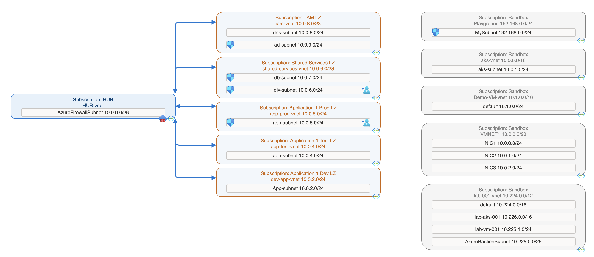

# CLOUDNET DRAW

A Python-based tool for automatically generating visual diagrams of Azure virtual networks using topology data exported from the Azure API. This script creates `.drawio` diagram files representing Hub-and-Spoke network architectures, making it easier to audit, present, and understand complex Azure network infrastructures.

---

## 📌 Key Features

- 🔎 Converts Azure VNet topology (JSON) into visual diagrams
- 📄 Outputs `.drawio` files (open with [draw.io / diagrams.net](https://draw.io))
- 🖼️ Supports hub, spoke, subnets, peerings, and Azure service icons (NSG, UDR, Firewall, etc.)
- 🧠 Logic-based layout:
  - Peered vs non-peered spokes
  - Left/right layout split for better readability
  - Icon placement and subnet expansion
- 🧩 Extendable for MLD, HLD, and custom peerings

---

## 🖼️ Example Output

> 💡 The tool outputs `.drawio` files. You can export them to PNG, JPG, PDF, or SVG using the [Draw.io Desktop CLI](https://github.com/jgraph/drawio-desktop).

---

## ⚙️ Requirements

- Python 3.8+
- Azure topology JSON export (your own format or adapted from Azure API)
- Recommended: [Draw.io Desktop](https://github.com/jgraph/drawio-desktop/releases) for viewing/exporting diagrams

Install dependencies:
pip install -r requirements.txt

## Setup
## macOS / Linux
python3 -m venv venv
source venv/bin/activate

## Windows
python -m venv venv
venv\Scripts\activate

## 🚀 Usage
For just testing the solution use Azure CLI with "az login" and run the "azure-query.py" file. The script will list out subscriptions you have access to and ask that you choose which of them to include, comma separated.

For normal usage create a service principal in Azure and delegate access to the service principal to the network environments you wish to map out.
Add the credentials for the service principal in the "azure-query-sp.py"

Both of them will generate the "network_topology.json" output file.

The HLD.py and MLD.py files both use the same JSON file as input, you can run them to generate a drawio file from the JSON.

HLD.py / MLD.py
By default, the script creates:

network_hld.drawio & network_mld.drawio

## 📄 License
This project is licensed under the MIT License.
You are free to use, modify, and distribute it with attribution.

## 🤝 Contributing
Pull requests and suggestions are welcome!
If you have ideas for enhancements (e.g. support for internal peerings, multi-hub views, or layout options), feel free to open an issue or PR.

## 👨‍💻 Author
Kristoffer Hatland
🔗 ([LinkedIn](https://www.linkedin.com/in/hatland))  • 🐙 ([GitHub](https://github.com/krhatland))

## 🚧 Coming Up Next
Azure Function App integration for cloud-native execution
Optional image export (.png) using Draw.io CLI
GitHub Actions support

 
<strong>🛠 Troubleshooting: SSL Certificate Errors on macOS</strong>

If you encounter an error like this:

"SSLError: certificate verify failed: unable to get local issuer certificate (_ssl.c:1129)
It's usually due to missing trusted root certificates in your Python environment."

✅ Fix for macOS (python.org installs)
If you're using Python installed from python.org, run this command outside your virtual environment:

/Applications/Python\ 3.X/Install\ Certificates.command
Replace 3.X with your Python version (e.g. Python 3.11 or Python 3.13)

This is a one-time fix that installs the correct trusted certificates.

💡 After running the fix
Recreate or activate your virtual environment:

python3 -m venv venv
source venv/bin/activate
pip install -r requirements.txt
Test certificate validation:

python -c "import requests; print(requests.get('https://pypi.org').status_code)"
✅ You should see 200 as the output, confirming SSL works correctly.

🧯 Still not working?
If you're in a corporate network or using a managed device, the issue may be related to firewalls, proxies, or custom certificates. Please contact your IT department for assistance.

## 🛠️ Note for Users in Corporate Networks (SSL Errors)

If you're behind a corporate proxy that injects SSL certificates (e.g. ZScaler, Palo Alto, company CA), you may experience `certificate verify failed: Missing Authority Key Identifier`.

Try these fixes:
1. Use `az login` _outside_ the virtual environment first.
2. Export your corporate root CA together with certifi:

cat ~/your-company.crt $(python3 -m certifi) > ~/full_bundle.crt
export SSL_CERT_FILE=~/full_bundle.crt
export REQUESTS_CA_BUNDLE=~/full_bundle.crt

